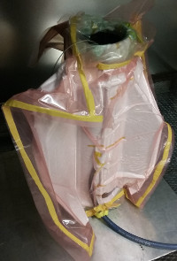

# LV3 Fin Manufacturing Procedure

This is the step-by-step for creating fins for the LV3 airframe and attaching them to a module. 
Currently, there are "only" enough aluminum slabs to manufacture two fins at a time, so don't try to prep three fins at a time...

## Preparation
1. Put on powder-less nitrile gloves. If you gloves get dirty, greasy, etc., replace them. Even if you don't care about your health, you still need to keep your skin oil off of the layup!
1. Lightly sand the CF-bonding surfaces of the fins frames (the slight depression on the edge of the ) using 600 grit sand paper.
1. Clean the fins by wiping them with an acetone soaked shop towel until no residue comes off on the towel. 
1. Continuously apply part A of the anti-galvanic treatment to the CF-bonding surfaces for 4 minutes.
1. Wait 10 minutes.
1. Continuously apply part D of the anti-galvanic treatment to the CF-bonding surfaces for 4 minutes.
1. Wait 1 hour.
1. While you wait... 
	1. Cut out the appropriate nomex sections from templates (use the male templates). You will end up cutting some sections that don't snugly fit into the frames. Cut some redundant sections and use the ones that fit. They should stay in the frame when it is picked up and turned around. You may need to cut them slightly larger than the templates to accomplish this.
	
	1. Cut out the sections of CF and adhesive. Note that they use slightly different templates. Take care to cut the CF so that the fibers are aligned to the root and tip edges of the fin. It's helpful to place a weight on one half of the template, make your cut, place a weight on the half you just cut, remove the first weight, and then finish the cut. The sharp angles of these pieces may slide around underneath the template otherwise.
	1. While the adhesive is cold (put it in the freezer for a half minute, if you need to), partially separate the paper and plastic backings from the adhesive sheets you just cut. An awl works *very* well for this. Fold the partially removed backing, for easy removal later.
1. Arrange the nomex sections in a fin frame. If there are any gaps between the nomex and the frame much larger than a nomex cell, you will need to replace that nomex section.

## Slab-fin-slab assembly
1. Place the fin frame on an aluminum slab with the flange pressed up against the edge of the slab. 
1. Lightly tape the flange to the slab to prevent slipping. 
1. Remove the red plastic backing on an adhesive sheet. (leave the plastic backing on)
1. Carefully place and align an adhesive section on the frame. Take care that there is an even gap between the adhesive section and the edge of the lip.
1. Press your hands gently on the adhesive section, tacking it in place with your body heat.
1. Remove one sheet of plastic backing from a CF sheet.
1. Carefully place and align the CF sheet on the frame. There will be no gap between the CF and the lip. Take care not to force the CF down into the frame at the root.
1. Use hand heat to tack down the CF to the adhesive. 
1. Remove the remaining plastic backing from the CF sheet. 

1. Lay a sheet of non perforated release film over the CF. 
1. Gently smooth out the release film to eliminate creases and folds. 
1. Carefully place an aluminum slab down on the fin, just ahead of the flange.
1. Slowly slide the aluminum slab to make contact with the flange. 
1. Tape the flange to the upper aluminum slab. 
1. Slide the assembly to the corner of the work bench so that the ends of the aluminum slabs are hanging off, taking care not to let them slide relative to the fin.
1. Clamp the two slabs together. Tighten both clamps simultaneously, so the upper slab doesn't tilt.
1. Flip the assembly over and remove the clamps.
1. Cut the tape on what is now the upper slab, so that it doesn't pull up the fin when you remove it.
1. Remove the upper slab. 
1. Repeat the above procedure for the exposed face of the fin:
	1. Apply adhesive
	1. Apply CF
	1. Apply release film
	1. Place a slab on the fin
	1. Tape the slab to the flange.

## Completing the assembly
1. Place the assembly in the oven, taking care to prevent the slabs from sliding relative to the fin.
1. Slide a slab under the tip of the fin protruding from the assembly. Take extra care to prevent the fin from sliding around in the assembly.
1. Place two spacers around the fin on the top of the slab you just placed.
1. Repeat the above steps to create another slab-fin-slab assembly.
1. Carefully place the new assembly on top of the spacers so that the lower slab of the new assembly is flush with the upper slab of the old assembly. Be very careful that neither of the fin flanges unseat from their slabs. 
1. Place two spacers around the tip of the new fin, on the top of the top flange of the first fin. 

## Cooking
1. Place a slab on top of those spacers. Be careful you don't unseat the second fin flange from its slabs. 
1. Place the tip of a \[calibrated\] thermocouple into one of the gaps created by the fins/spacers. The thermal inertia of the slabs will make the temperature of the fins lag behind the temperature of the oven. They will also make the ramp-up process much longer. 
1. Close the oven and begin the cure cycle. 
	1. 3 degrees F per minute ramp up (The oven won't actually be able to manage this.)
	1. 350 degree F hold for 2 hours
	1. Turn the oven off and open the doors.
	1. Wait until the oven declines to a "safe" temperature (100 degree F air temperature)
	1. Close the oven doors and come back tomorrow to open the fins.

Since the temperature of the fins lags behind the air temperature of the oven, you'll want to set the oven about 40 degrees F above the prescribed temperature and then set it back to the prescribed temperature when the temperature of the fins is 10 degrees below what's described. (The point of this is to try and preempt the heat propagation through the slabs.) 
If you are impatient and take the fins out of the slabs too early, they will experience large differential thermal expansion, and can develop warping. 

## Fin Attachment
Once the fins are cooked, they will need to be attached to a module. 

### Fin Alignment
1. Sand the inside surface of the fin flanges with 600 grit sandpaper.
1. Clean the inside surface of the flanges with an acetone soaked shop towel until no residue comes off on the towel.
1. Continuously apply part A of the anti-galvanic treatment to the inner surface of the flanges for 4 minutes.
1. Wait 10 minutes.
1. Continuously apply part D of the anti-galvanic treatment to the inner surface of the flanges for 4 minutes.
1. Wait 1 hour.
1. While you wait: 
	1. Cut out 3 sections of vacuum bag and breather material, wide enough that they will span two fins tip-to-tip with 6" to spare, and long enough that they have 6" to spare.
	1. Cut out a section of vacuum bagging material at least 12" longer than the module and 20" wide. If you have different colors of vacuum bagging material, use a different color than the 3 pieces you just cut out in order to differetiate them easily.
	1. Cut out 3 sections of adhesive using the fin flange template. 
	1. Place the adhesive sections in the freezer for a minute and use an awl (or similar sharp implement) to partly peel off the plastic and paper backing, folding it afterwards for easy removal. 
	1. Slide two nuts onto each of the threaded rods for the fin jigs. 
	1. Slide one of the fin jigs down onto the module. You may need to jiggle it around a bit to get it over the end of the module. Do not force it on. If it won't go on over one end, try the other. 
	1. Slide the threaded rods into the jig you just placed, so that the two nuts are in the middle of the module.
	1. Slide the remaining jig onto the rods and the module. 
	1. Thread nuts onto the ends of the rods (6 in total).
	1. Set the module down on a flat, rigid surface (thick MDF works well) female end down. 
	1. Adjust the bottom most nuts so that the bottom jig sits at X.XX". The jig gauge (wooden puck that's a circular arc) should be used to confirm your alignment.
	1. Tighten down the 2nd-from-the-bottom nuts to fix the bottom jigs in place. 
1. For each fin:
	1. Remove the plastic backing from an adhesive sections.
	1. Carefully align the adhesive section on the fin.
	1. Holding the fin tip-down, use a heat gun to bond the adhesive to the flange. Stop when the adhesive becomes glossy and the flange is very uncomfortable to touch.
	1. Wait for the adhesive to return to room temperature.
1. Slide the fins into the bottom jig, holding the upper jig up out of the way.
1. Slide the upper jig down onto the fins. 
1. Tighten down the top most nuts so that the top jig snugly holds the fins. 
1. Tighten the 2nd-from-the-top nuts to hold the top jig in place. 
1. Use the wooden fin alignment jig to confirm the alignment of each fin. Slide the slot of the jig over the fin, holding the base down on the platform. The jig should slide along the length of the fin freely, while remaining flat on the platform. If it does not, loosen the top jig and try again. 
1. Slide the fins into the bottom jig, holding the upper jig up out of the way.
1. Slide the upper jig down onto the fins. 
1. Tighten down the top most nuts so that the top jig snugly holds the fins. 
1. Tighten the 2nd-from-the-top nuts to hold the top jig in place. 
1. Use the wooden fin alignment jig to confirm the alignment of each fin. Slide the slot of the jig over the fin, holding the base down on the platform. The jig should slide along the length of the fin freely, while remaining flat on the platform. If it does not, loosen the top jig and try again. 
1. Once the fins are all aligned, go over each flange with a heat gun until the flange is uncomfortably hot. 

### Vacuum Bagging

1. Use kapton or flash tape to tape strips of unperforated release film over all the edges of the flanges, to prevent the breather material from sticking to the adhesive.
1. Wrap the module in the 3 sections of breather material you cut earlier, using kapton or flash tape to secure it. Make sure all sharp edges, including the coupling rings, are covered in breather material. Make sure the path the air can follow spans the entire outside area of the fin canister.
1. Along the long edge, bond two sheets of vacuum bag together using goop tape with shrink tape. (one on top of the other, *not* forming a larger sheet) Run your fingers along the edges of the bond and take care to press out any air channels or large bubbles that compromise the seal.
1. Similarly bond the remaining vacuum bag sheet to the two you just bonded, so that they form a big triangle.
1. Bond the long edges of the remaining vacuum bagging sheet using goop tape in order to form a tube to go inside of the module. Run your fingers along the edges of the bond and take care to press out any air channels or large bubbles that compromise the seal.
1. Flip the fin can assembly over so that the male ring is down.
1. Slide the triangular vacuum bag over the fin can assembly.
1. Slide the tubular vacuum bag inside the module.
1. Bond the ends of the two vacuum bags.
	1. Line the inside of the end of the triangular bag with a strip of goop tape, leaving the wax paper on the tape.
	1. Removing the wax paper from the tape, bond the end of the triangular bag to the end of the tubular bag, forming the vertices of the triangular bag into pleats and forming pleats in the tubular bag as appropriate. 
	1. Take care to completely seal the seam of the tubular bag. Forgetting to do this is a very common mistake.
	1. Run your fingers along the edges of the bond and take care to press out any air channels or large bubbles that compromise the seal.
1. Arrange the seam you just formed so that the module may rest flat. This can be done by pulling the tubular bag out a little and spreading out the seam so it encircles the female coupling ring.
1. Carefully flip the assembly over so that the female ring is on bottom.
1. Wrap the end of the vacuum hose with breather material, and tape it on.
1. Insert the vacuum hose into the vacuum bag, between the triangular bag and the breather material, next to the threaded rod. Use goop tape to secure it in place.
1. Form a collar of goop tape around the hose, so that it will cleanly bond to the ends of the bag.
1. Seal the remaining ends of the bag as before, taking care to seal the seam of the tubular bag.

### Cooking
Now that the fins are mounted to the module via the fin jig and covered in a vacuum bag, the adhesive must be cured. 

1. Place the assembly into the oven, feeding the hose through the hole in the wall of the oven.
1. Slowly turn on the vacuum pump, making sure nothing goes wrong with the vacuum bag.
1. Inspect the bag for leaks. You will need to get your ear close to the bag and search around for a hissing other than the noise of the vacuum pump.
	1. Pinch-closed out any air channels forming leaks. Use goop tape to complete the seal, if necessary.
1. Close the doors and turn on the oven. 
	1. Ramp at 3 degrees F per minute.
	1. Hold at 300 degrees F for 2 hours. For Meldbond 1515 and the CF from PCC, this is hot enough to cure the adhesive but does not exceed the working temperature of the epoxy.
	1. Ramp down at 10 degrees F per minute. (or just turn off the oven and come back in the morning)
