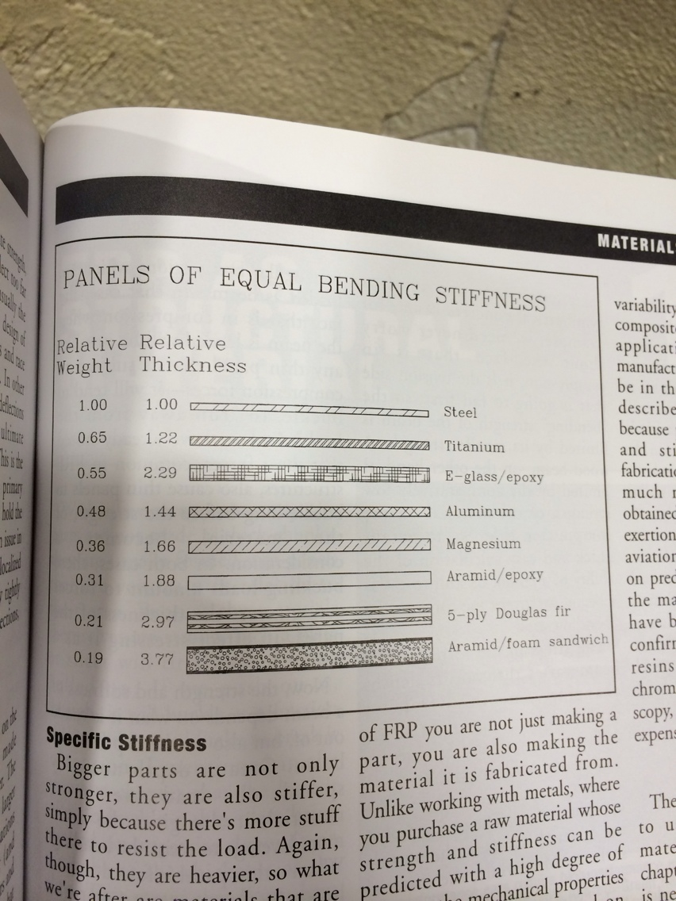
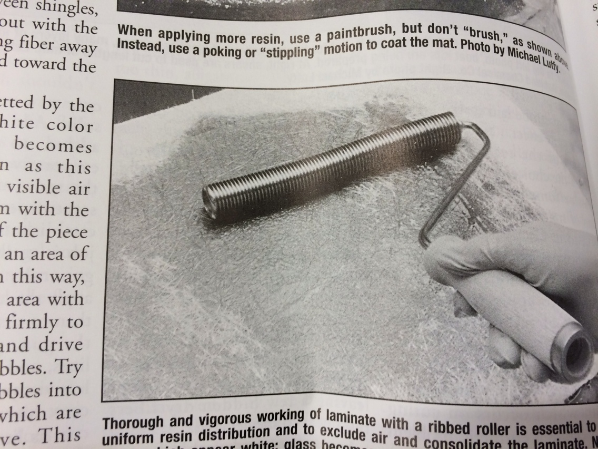
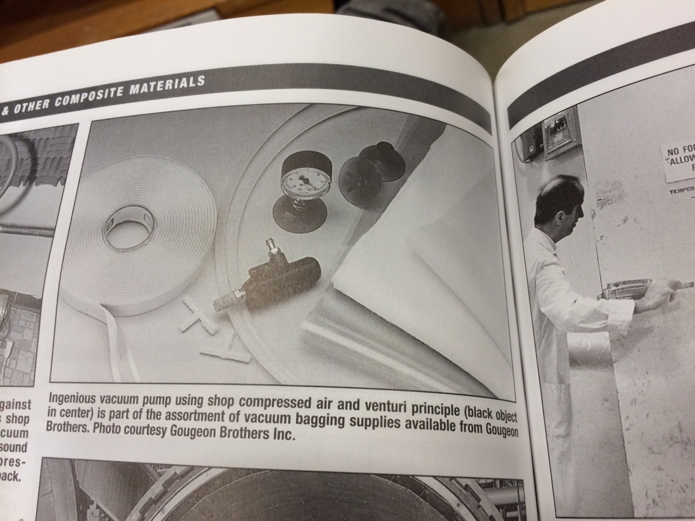
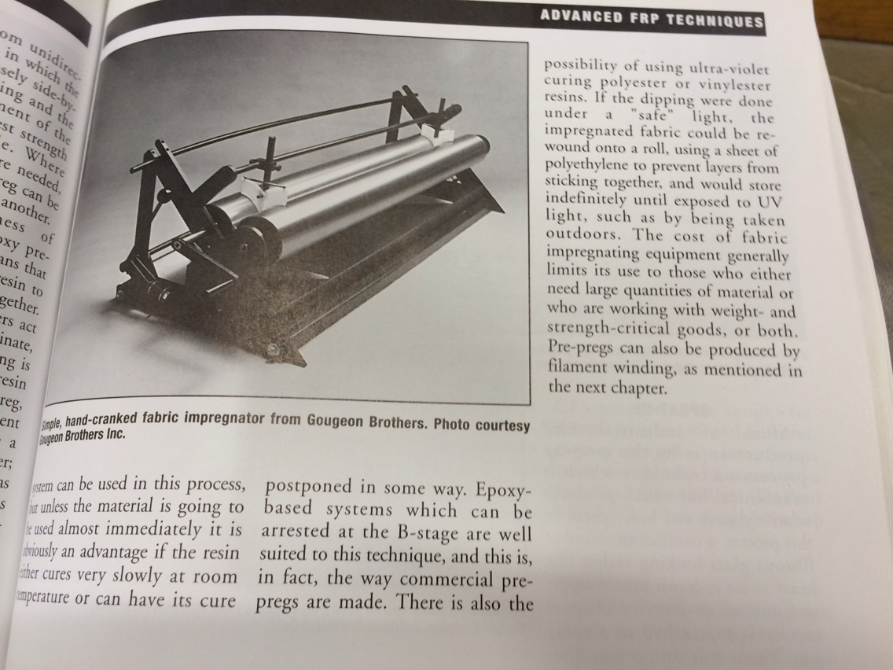
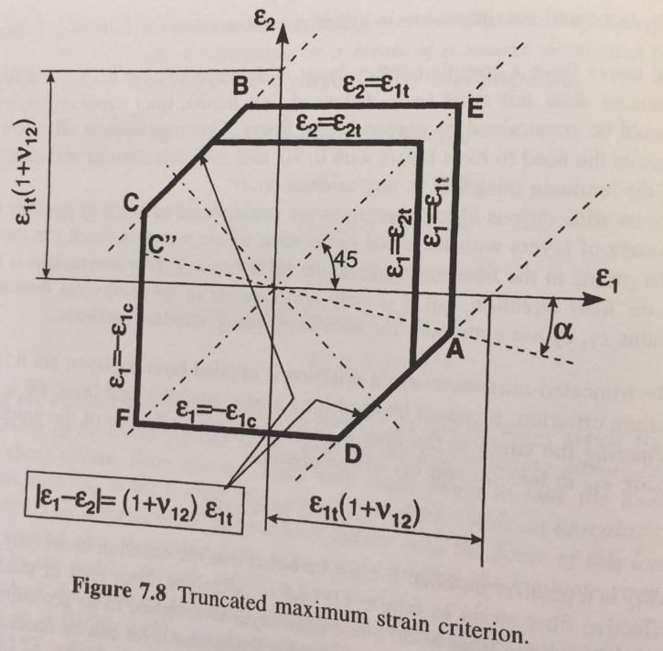
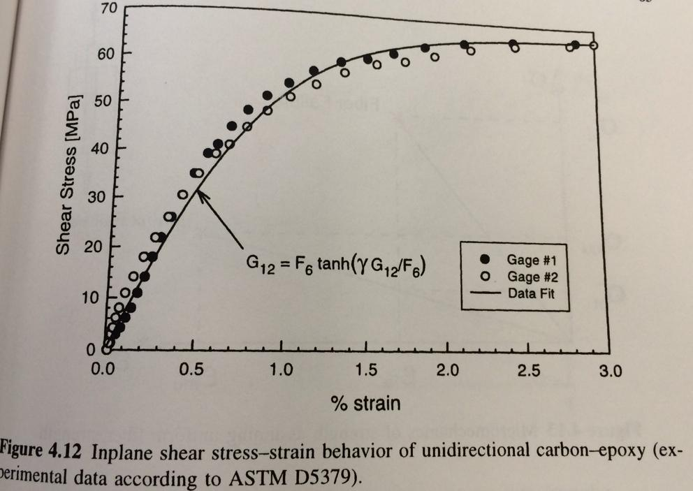
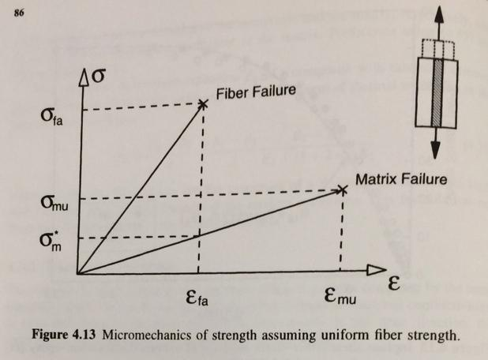
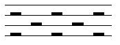
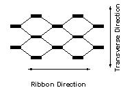
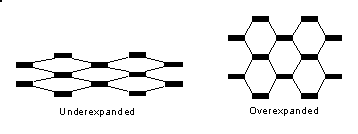

### 

### Abstract:

The purpose of this manual is to provide a space for documentation of knowledge and research necessary to the Composite Airframe Capstone Team. It will serve as a running manual for sharing information between team members, and as a textbook style resource for future airframe designers on PSAS to use for future iterations. Information for this book was taken from various texts, videos and conversations with industry professionals. It is supposed to be a concentration of data from available sources.

Bibliography:
=============

Fiberglass and Other Composite Materials- A guide to high performance non metallic materials for race cars, street rods, body shops, boats and aircraft. HP books. Forbes Aird

Introduction to Composite Materials Design. Ever J Barbero, department of mechanical and aerospace engineering, West Virginia University, USA. Taylor and Francis group

Taylor, Travis. *Introduction to Rocket Science and Engineering*. CRC Press 2009. Boca Raton, FL.

Composite Airframe Structures, Michael Chun-Yung Niu. 978-9627128113. Hong Kong Conmilit Press Ltd.

Aramid (Kevlar) Fiber
---------------------

DuPont’s aramid product is called kevlar. A high modulus version called kevlar 49 is widely used for composites. Kevlar 149 has higher stiffness but less strength, and Kevlar 29 is not very stiff but is used in body armor.The compression strength of a Kevlar laminate, however, is limited by the apparent inability of any resin matrix to wet the fine fibrils that make up the fiber bundle; the outside of the bundle gets surrounded by the resin and attached to it, but individual fibrils do not. As a result, when a laminate is loaded in compression, the individual fibrils buckle when the stress exceeds about one fifth of what it would take in tension. Thus, the properties of the laminate become dominated by the characteristics of the resin matrix, and a Kevlar laminate’s strength in compression is limited to relatively low values.

On the other hand, the gradual buckling of the fibers acting under the restraint of the matrix means that an aramid laminate does not fail in a brittle manner like those made from other structural fibers, but “yields” much like metals. In the process of failing in this way, a substantial amount of energy gets absorbed, which makes it attractive to manufacturers of aircraft and race cars. This property together with its all around toughness (which is why kevlar is very difficult to cut cleanly) also makes it very popular for lightweight canoes and kayaks.

Kevlar can be used by itself or in combination with other fibers. Either as one or more separate plies, or woven together into a hybrid fabric. Combined in these ways with CF, it is widely applied in race car construction as a hedge against the brittleness of carbon. You won’t see much crumpled carbon fiber in crashes- it just explodes into dust when it is grossly overloaded in this way.

Another significant feature of kevlar is its light weight. An aramid based laminate will typically wind up about 20% lighter than a part of the same thickness using glass or, for that matter, carbon. Used as a direct substitute for glass reinforcement in lightly stressed body panels, kevlar cloth yields a part that is about ⅕ lighter yet stronger than the part it replaces. Kevlar deteriorates slowly when exposed to ultraviolet light, so some sort of paint or other covering is needed to exclude UV from a kevlar laminate. This hardly matters in practice because Kevlar is invariably combined with epoxy resin, which itself needs protection from UV, no matter what the reinforcement.

Composites made from Kevlar 49 compare unfavorably to carbon fiber composites in terms of stiffness, both on a per volume and a per weight basis. On a same weight basis, a Kevlar 49 laminate will give one half to one quarter the stiffness of one made from carbon.

Fabrics
-------

There are tons of different kinds of fabrics. Unidirectional fabric has most of the fibers running one way, with just a light crossweave at wide intervals to hold the whole thing together. This means all of its strength is in one direction. Others have an equal number of yarns running in both the lengthwise (called the warp), and the crosswise direction (the fill), producing a balanced, bi-directional fabric with equal strength properties in both the lengthwise and crosswise directions. Of course strength and stiffness are degraded heavily when you rotate the carbon between 0 and 90 degrees.

Weaves
------

For any basic type of weave, the strength and stiffness of the finished product depends on the volume fraction of fiber. Tight weaves give the best strength and stiffness values, but are more difficult to wet out; open weaves are easier to saturate, but yield a laminate which is less strong because of the greater proportion of weak plastic in relation to the amount of strong reinforcement.

Satin Weave
-----------

Crimping of the yarns is reduced if each warp yarn crosses over more than one fill yarn before crossing under one. Such patterns are generally termed satin weaves, and are further identified by the number of successive fill threads that are skipped over; thus there are five-harness and seven-harness satins etc. Because of this more advantageous geometry, laminates using satin weave fabrics generally show slightly superior strengths than those made from square weave materials, especially when loaded in compression. Because the yarns in a satin weave can skew more easily than in a square weave, they have superior drapeability, it is easier to get them to conform to tight curves, especially ones with complex changes in radius. Also, satins yield a smoother surface finish than a square weave of the same height. Taken together, these advantages often justifyn the slightly higher cost of satin weave fabrics.

Polyester
---------

Although other resin systems are starting to make inroads, especially for high performance applications, the overwhelming majority of FRP work (&gt;90%) is based on polyester. Epoxies usually produce stronger laminates than polyester. the surface of kevlar just doesn’t seem to connect well with polyester.

Beyond the fact that they are cheaper than epoxies by half or more, polyesters remain predominant for the very good reason that they are easy to work with. First, they are low in viscosity, which means it is easier to pour pump mix etc. The cure rate of polyester can be adjusted over a wide range varying the amount of catalyst added, which is absolutely not the case with epoxy. Finally, polyester is arguably less hazardous to work with than epoxy, though it might be better to say that the hazard is different.

Polyester has several drawbacks, however. It is generally inferior in strength to laminates done with epoxy…

These are the cheapest of all the resins. They have poor bonding capability and should never be used for any structural carbon or aramid work. They typically work well only on fiberglass. One should generally never consider using this resin with structural applications with Carbon Fiber or Aramid.

**Styrene-Suppressed Resins**

If you have read or heard anything about FRP work, you will probably have encounter a distinction made between laminating resin and surfacing resin. A feature of conventional polyester blends is that their cure is inhibited by exposure to oxygen in the atmosphere. What that means is that while the bulk of the resin will cure soid, a very thin layer on the top surface will remain tacky. This helps subsequent layers to bond to one another, so this laminating resin is used wherever additional plies are to be added.

Epoxy
-----

Laminates using epoxy generally have greater strength and better chemical resistance than those using polyester, especially at higher temperatures. Epoxy also shrinks less than polyester (40 to 50% less) depending on the curing agent used. As well, some fibers like kevlar and carbon are incompatible with polyester. On the other hand, epoxies are distinctly trickier to handle than polyester, introduce different health risks, and both they and their curing agents are significantly more expensive.

Epoxy resins used in composite fabrication are more viscous and sticky than polyesters. This makes it more difficult both to ensure complete mixing of the resin and hardener, and to wet out the reinforcement, adding to labor and increasing the risk of areas of incompletely saturated resin reinforcement. It is worth emphasizing here that the neccessity for complete and thorough mixing of epoxies. To ensure that all of the resin is mixed with all of the hardener, suppliers urge that you change containers during the mixing. Here’s how: dispense resin into A, and mix thoroughly, scraping the side of the container to deal with either component that may be sticking to the sides. Then pour this mixture into cup B, and continue to mix. Any unmixed resin or hardener remaining in cup A will have been left behind. If you are proportioning the two components by weight, rather than by using a proportioning pump, then you may even have to resort to a three cup technique. This sounds a bit obsessive, but there is little doubt that most problems with epoxy result either from an incorrect resin to hardener ratio, or from inadequate mixing.

Thinners are available to reduce the viscosity of epoxy resins. Although these are reactive with dilutents, they cross link with the resin in much the same way that styrene does with polyester, they should be employed with caution. Dilutents may reduce the strength and chemical resistance of the finished product, and certainly will if added in sufficient quantity to make the resin as easily worked as polyester. Some thinners are particularly toxic.

Mixing is the second problem with epoxies. Epoxies must be mixed with the resin in a specific proportion, and some require very accurate measurement. If off by more than a smidgen the result can be anything from an incomplete cure, to no cure at all. What’s more, this intolerance of variability in the hardener to resin ratio makes it so the cure rate of epoxy systems cannot be adjusted by varying the amount of hardener. If you want to speed up the cure, you have to pick a different curing agent, or increase the temperature of mold/workspace.

The very strongest laminate produced with epoxy systems have to have an elevated curing temperature usually from 100F to 350F.

Carbon Fiber parts will absorb radar microwaves.

Note that most epoxies are slightly amber in color. When you apply the typical amount of resin to a composite, that is just enough to wet-out the composite, the epoxy is clear.

There are only about 4 epoxies in the market that will not yellow over time. The West System 207 is the best of them all (that is the reason we sell West System's Epoxy). Even for indoor applications, UV will eventually yellow your epoxy. So if you don't plan on painting you piece/application and you want your piece to look good and last as long as possible, plan either protecting it with UV coating (such as a UV urethane), and/or use the 207 hardener.

Gel Coat
--------

To produce parts with a smooth shiny surface comparable to painted metal, something needs to be done about the appearance of raw fiberglass mat, or the fabric weave of cloth. For such parts, a coating of pure plastic resin containing no class or other fiber is usually applied to the mold surface and permitted to cure before any glass is applied. Conventional gel coat is nothing more than polyester resin, with a few added ingredients. To prevent runs and sags when the gel coat is applied to a vertical surface, a thixotropic agent, usually silica gel, is blended in, to add body and so resist the flowing under the effect of gravity.

MEKP
----

MEKP is a clear colorless liquid. It is explosively unstable in its pure form and so is supplied as a diluted solution in an inert liquid buffer. While it is not itself highly flammable, it is a powerful oxidizer which may cause some readily flammable substances- like paper, rags, or sawdust- to ignite spontaneously if it comes in contact with them. It is also quite corrosive, and prolonged contact will cause skin burns. Splashed in the eyes can cause permanent damage. The vapors may cause headaches and intoxication, and corrosive damage to the nose, throat and lungs. This is the catalyst for polyester resins.

PVA
---

With a new mold, you first wax and thoroughly buff several times, at least three. (You don’t need that much wax, but you might have missed a few spots the first time. Terry-cloth toweling seems to work well for the waxing and buffing. Next, you apply a coat of polyvinyl alcohol, which dries to form a thin barrier film that provides a second line of defence against the nightmare of a part firmly stuck in the mold. PVA is not only unnecessary in a well made, aged mold, it is undesirable since the PVA leaves a slightly pebbly, orange peel texture on the surface of the finished part that has to be polished out.

It is possible to apply without a spray gun (a small piece of old t-shirt seems to work better as an applicator than a brush), but spraying is definitely preferable. The PVA should be sprayed in stages, starting with a very light misting, and finishing with several heavier coats. Obtaining a uniform and, above all, a continuous film of PVA is much easier if the mold has a color that contrasts well with the PVA, which is green.

Elevated Temperature Curing Epoxies
-----------------------------------

For applications where minimum weight and maximum strength are important, higher performance resins may be selected, and that often means epoxy resin systems designed to cure at higher than room temperatures. For a true high temperature cure (HTC), the temperatures required with some resin systems are so high (up to 400F) and the demand for close control of the heating so strict that homemade arrangements are inadequate. The only solution is a purpose-built oven, fitted with precision timers and automatic temperature controls. Large and expensive industrial ovens are available for this purpose.

Heating Methods
---------------

Never forget that an oven is simply an insulated box with a heat source inside; in some cases it may be quite practical to make your own. It is not prohibitively expensive to construct a frame for a simple shed-like structure out of steel (not wood), with sheetrock walls and ceiling, heavily insulated on the back side with rock wool or fiberglass batts (forget about foam insulation; apart from increased fire risk, insulating foams may soften at the temperatures involved).

Cautions- while undiluted epoxies do not include flammable, low boiling point solvents, like the styrene in polyester and vinylester resins, these materials are nevertheless flammable, and extreme care must be taken to avoid fire. That pretty much limits the possible heat sources to electricity, steam and hot water, through the use of water is obviously limited to temperatures below its boiling point of 212F.

Heating the mold is another alternative to heating the air. Possible to use electric resistance heaters.

Expansion
---------

Another factor to bear in mind whenever exposing a laminate and mold assembly to elevated temperatures is the issue of compatibility of the mold and laminate materials. For one thing, their comparative thermal expansion has to be considered, especially if the dimensions of the part are critical. For example, some carbon fibers exhibit negative thermal expansion- they get smaller as they heat up. Other forms of carbon fiber do have a positive thermal expansion coefficient, but they grow much less with heat than most other FRP materials. For this reason, the molds for carbon fiber reinforced race car and aircraft components using ETC resin systems are themselves usually made from the same CF as the part, to ensure that the mold and laminate shrink and grow in sync.

Fabric impregnator
------------------

There is also a method of working that involves something like a homemade prepreg, using a machine called a fabric impregnator. This apparatus mechanically draws woven or unidirectional goods through a bath of resin and then passes it through a set of pinch rollers, yielding more uniform resin distribution and a higher reinforcement to resin ratio than is usually possible with hand work. At the same time, labor is reduced.Virtually any liquid resin system can be used in this process., for unless the material is going to be used almost immediately it is obviously an advantage if the resin either cures very slowly at room temperature or can have its cure postponed in some way. Epoxy based systems which can be arrested at the b-stage are well suited to this technique, and this, in fact, is the way commercial prepregs are made. There is also the possibility of using UV curing polyester or vinylester resins. If the dipping were done under a “safe” light, the impregnated fabric could be rewound onto a roll, using a sheet of polythylene to prevent layers from sticking together, and would store indefinitely until exposed to UV light, such as by being taken outdoors. The cost of fabric impregnating equipment generally limits its use to those who either need large quantities of material or are working with weight and strength critical goods, or both. Prepregs can also be produced by a filament winder.

Male or Female?
---------------

Assuming conventional hand layup, the surface of the finished product that contacts the mold will have a glossy surface, while the back face will be rough, so for goods where visual appearance is important, the surface that is exposed determines which way it must be molded. Thus, a bathtub would be formed over a male mold, while a canoe would be made in a female mold.

The Expendable or Sacrificial Mold

One is a technique for making tanks of all sorts by carving a chunk of foam to the desired shape, wrapping it entirely with resin saturated reinforcement, and then dissolving out the foam plug with a suitable solvent once the shell has cured. This is undeniably an intriguing technique, but there are a few intrinsic limitations: the foam must be unaffected by the resin system; the resin must be impervious to the solvent used to purge the core; the thickness of the wrapping may need to be taken into account when shaping the core; and the outer surfaces of the finished tank necessarily has the texture of the fabric used.

Fatigue
-------

An advantage of composite materials sometimes touted in print is that they do not fatigue. This is simply not so, though it is true to say that the fatigue resistance of composites is generally superior to that of metals. Unidirectional laminates using kevlar retain about ¾ of their static strength after ten million cycles of loading in tension (though they do less well when the loading reverses between compression and tension); similar carbon fiber laminates keep perhaps two thirds of their original strength; glass fiber composites are down to about half by that point.

**Sandwich Structures**

Sandwich structures present particular problems around bolted connections, and anyplace else where loads are highly localized. One technique for dealing with this is to remove the core in the area surrounding the attachment, and bring the two skins together, locally reinforced with additional layers of laminate. It is common for at least some of this extra material to be a thin sheet of aluminum, to take advantage of its isotropic, ductile nature.

Surface Bonding
---------------

Provided the surface is properly prepared, aluminum will bond securely to an epoxy laminate. The key phrase is properly prepared. Understand first that aluminum oxidizes- exposed to air, the bare surface of a piece of aluminum almost instantly reacts with the oxygen in the atmosphere to form aluminum oxide. If you attempt to stick anything to an untreated piece of aluminum, what you wind up doing is gluing to the oxide, not the aluminum itself. In principle, that ought not to be a problem, provided, first, that the oxide is well and truly attached to the metal beneath and, second, that the adhesive is well and truly bonded to the oxide. There are potential problems on both scores, as the aerospace industry discovered when they began gluing airplanes together.

To cut a very long story short, the procedures that Boeing and the other heavy hitters involve a succession of steps to de-grease, acid etch, and anodize with phosphoric acid, with rinsing in deionized water after each step.

**How FRP Composites Carry Loads**

Many people believe that the strength of an frp laminate is unnecessarily reduced whenever any of the fibers in it are broken. This is definitely not so. It is equally untrue that a fiber has to extend from one end of a load carrying part to the other in order to contribute to the strength of the laminate.

First realize that a fiber, by definition, is something that is many times longer than its diameter. Now, in a properly constructed laminate, all of the surface of each fiber is firmly attached to the resin that surrounds it, and the area of that contact is many times greater than the cross sectional area of the fiber. Now imagine a small zone within the laminate where two fibers, lay side by side, fairly close to each other, but only partly overlapped in strength, so one is closer to one end of the laminate, overall, and the other closer to the opposite end.

If we anchor one end of the laminate and pull on the other, there will be a tendency for the two fibers to slide past each other. Each, however, is stuck to the surrounding resin, so the interface between fiber and resin is stressed in shear- the fiber is trying to slide through the resin, and the “hands off” the load to the next adjacent fiber. Provided each fiber is long enough in relation to its diameter, then even though the shear strength of the resin is a mere fraction of the tensile strength of the fiber, there will be so much more resin carrying the shear load than there is fiber carrying the tension load that the the fiber will break before the plastic does.

There is some minimum length of fiber for which this will be true, and that is why a laminate made with say, short chopped strand reinforcement will not be as strong as one using longer fibers. On the other hand, if the minimum length criterion is met, longer fibers will not make the laminate any stronger. Equally any more resin than is needed to pass the load from one fiber to the next does nothing to increase the strength of the laminate and just adds weight.
Another way to look at it is on the basis of tensile stresses. In the previous chapter, we saw that any material which is pulled lengthwise will stretch somewhat, or strain, and that amount of this strain depends on just two things- the stress and the elastic modulus. Now when a composite is stress, all of it grows longer- the fibers and the resin have equal strains. The fiber, however is many times stiffer than the resin, so assuming that half the volume of the composite is fiber and half is resin (a representative figure), then the stresses in the two will be in the same ratio as their elastic moduli- about 25 to 1! Clearly, the matrix is lightly stressed, even when the fibers are carrying a very large load, and since the area of contact between the fiber and the plastic extends over the whole surface of the fiber, the matrix has no problem transmitting the load from one fiber to another.

Wet Lay-up
----------

When honeycomb core is used in wet lay-ups, it is common to first produce one skin, then for the core to be set down on the still wet laminate, so the laminating resin serves as the adhesive for this connection. The second skin is more problematic. If a wet lay-up is applied over the core to produce the second skin, there will be a tendency for the resin to drain out of the reinforcement and into the cells. About the only practical alternative is to produce the second skin independently, then to assemble it to the core using a film type adhesive. This obviously demands closer than typical control over the shape and dimensions of both core and skins.

Pre-Preg
--------

When the facings are produced from prepregs, this problem is avoided, and the choice is then between production of the two skins, allowing them to fully cure, followed by assembly to the core using film adhesive, or by letting the resin in the prepreg serve as the glue and completing the assembly before either skin is cured, a technique called co-curing. Notably, the force required to peel the skin away from the core is different for the upper surface than from the under surface. This occurs because the differences in the shape and size of the fillet of resin that forms and the junction between each cell and the skin, in turn cause by the flow of the resin under gravity during the cure.

Fiber volume fraction
---------------------

The volume of fiber in a cured composite. The fiber volume of a composite material may be determined by chemical matrix digestion, in which the matrix is dissolved and the fibers weighed and calculated from substituent weights and densities or a photomicrographic technique may be used in which the number of fibers in a given area of a polished cross section is counted and the volume fraction determined as the area fraction of each constituent. Typical values for boron/epoxy and for graphite/epoxy, based upon the fiber type, is 55-67% fiber.

Mat, fabric and veil
--------------------

A mat is formed by randomly oriented chopped filaments, short fibers, or swirled filaments loosely held together with a very small amount of adhesive. A veil is a thin matt used as a surfacing layer to improve corrosion resistance of the composite. Veils and mats have fibers oriented randomly in every direction, leading to isotropic properties in the composite. Nonwoven fabrics are made directly from strands without the intermediate twisting of the strand into yarns.

Epoxy Resins
------------

Epoxies shrink less than other materials (1-4% by volume) which helps explain their excellent bond characteristics when used as adhesives. Epoxies are less affected by water and heat than other polymer matrices. Epoxy resins are also favored for their simple cure process that can be achieved at any temperature between 5C and 150C.

Isotropic/Anisotropic
---------------------

Isotropic materials (aluminum, steel) have the same mechanical properties in any direction. A typical example is the modulus of elasticity of wood, which is higher along the length of the tree and lower across the growth rings. The stiffness of an isotropic material is completely described by two properties, for example, the modulus of elasticity E and poisson’s ratio V. In contrast, up to 21 properties may be required to describe anisotropic materials.

Micromechanics and Fiber volume
-------------------------------

The stiffness of the equivalent CFRP material can be represented by five elastic properties:

E1: modulus of elasticity in the fiber direciton

E2: modulus of elasticity in the direction transverse to the fibers

G12: inplane shear modulus

G23: out of plane shear modulus

v12: inplane Poisson’s ratio

All of these are functions of the fiber volume fraction

These are of a similar naming scheme to how solidworks and ABAQUS call their variables

Thermal Expansion
-----------------

The thermal expansion coefficient of all resins are positive (about 30 to 100 E-6 /C) which is higher than steel alloys. Carbon fibers have a negative expansion in the fiber direction (-.99 E-6/C) and a relatively large expansion in the transverse direction (16.7 E-6/C). This means that depending on the amount of fibers (fiber volume fraction) it is possible to tailor the coefficient of thermal expansion of the composite to the user’s needs. Especially, it is possible to produce a composite material with a very low coefficient of thermal expansion, which is useful when dimensional stability is required.

Symmetric laminates experience no bending extension coupling. This is very important during fabrication because curing and subsequent cooling of the composite induces thermal forces. If the laminate is not symmetric, these forces will induce warping of the final part.

Longitudinal Tensile Strength
-----------------------------

The simplest model for tensile strength of a continuous composite is derived by assuming that all the fibers have the same tensile strength. Actually the tensile strength of fibers is not uniform. Instead, it is well approximated by a Weibull distribution. But as a first approximation it is assumed that all the fibers have the same strength equal to the average strength.

The second assumption is that both the fibers and the matrix behave linearly up to failure. This is not true for most polymer matrices that exhibit either elastic nonlinear or plastic behavior after a certain elongation. The behavior of polymers is further complicated by their load-rate dependency. That is, polymers are viscoelastic or viscoplastic.

The third assumption is that the fibers are brittle with respect to the matrix. Such large elongations to failure for fibers hold only in ideal conditions, with some fibers breaking at much lesser strain levels.

The fourth assumption is that the fibers are stiffer than the matrix. This is valid.

Under the assumptions listed, the composite will usually break when the stress in the fibers reaches their strength (average strength). After the fibers break, the matrix is unable to carry the load. Therefore, the composite elongation to failure, is equal to the fiber elongation to failure. At this strain level, the matrix has not failed yet because it is more compliant and can sustain larger strains. Under these conditions, it can be assumed that the longitudinal tensile strength is controlled by the fiber strength. This assumes the strain in the matrix and the fibers are the same, which is true if the fiber-matrix bond is perfect. The ultimate strain or stress of the matrix is not realized, because the fibers are more brittle.

Longitudinal Compressive Strength
---------------------------------

Compressive strength of continuous composites is lower than the tensile strength, about one half or less. The mode of failure is usually triggered by fiber microbuckling, when individual fibers buckle inside the matrix. The buckling process is controlled by fiber misalignment, shear modulus, and shear strength of the composite.

Fiber misalignment measures the waviness of the fibers in the composite. Fiber waviness is always present to some extent, even when great care is taken to align the fibers during processing. Waviness occurs because of several factors. The fibers are wound in spools as soon as they are produced, which induces a nature curvature in the fibers. Then fibers tend to curl when stretched on a flat mold. Furthermore, many fibers are wound together over a spool to form a tow or roving during fiber production. The fibers wound on the outside of the spool are longer than those wound in the inside. When the tow is stretched, the longer fibers are loose and microcatenary is formed.

Microcatenary can be shown by stretching a tow horizontally and letting the longer fibers hang under their own weight. The longer fibers hang in a catenary shape, just as electrical power lines do. In the final composite part, microcatenary appears as fiber misalignment.

The first formula for compressive strength was proposed recognizing the fact that compression failure is triggered by fiber microbuckling. The first approximation to the problem is to assume that the buckling load of the fibers is the limiting factor for compressive strength. To obtain the buckling load, some guy performed a stability analysis of straight fibers laterally supported by the matrix. Furthermore, the shear stress-strain law of the composite was assumed to be linear. Actually, PMCs have a nonlinear stress-strain law, as shown below. Such behavior is better represented by the relationship 4.66: tao= F6 tanh(g12 gamma /F6)

This approach can be used with an empirical correction, with testing for compressive strength.

Dimensionless compressive strength can be modeled in terms of dimensionless numbers, with the following formula 4.75: F1c=(X/a+1)^b G12. On page 94 from Intro to Composite materials design.

Laminate Description
--------------------

The notation used to describe laminates has its roots in the description used to specify the lay-up sequence for hand layup using prepreg. When using prepreg, all layers have the same thickness and only the angles need to be specified. In the hand layup process the laminate is built starting from the tool surface, or bottom of the laminate, adding layers on top. Therefore, the layers are numbered starting at the bottom and the angles are given from the bottom up. For example, a two-layer laminate may be \[30/-30\], a three layer one \[-45/45/0\] etc.

If the laminate is symmetric, like \[30/0/0/30\], an abbreviated notation is used where only half of the stacking sequence is given and a subscript ‘s’ is added to specify symmetric. The last example becomes \[30/0\]s. Since most laminates used are symmetric, there is the possibility of confusion when no subscript is used. To eliminate the possibility of confusion, a subscript ‘t’ may be used to indicate that the given is the total for example \[90/0\]T. A subscript number may be used to indicate a repeating pattern. For example \[(90/0)2\]T.

If the thicknesses are different use a subscript next to the degree marker. For example \[90t1/90t2/0t1/0t1\]S would mean a layer of the first thickness at 90, a layer of the second thickness at 90 etc. If all layers have the same thickness, the laminate is called regular.

Symmetric laminates experience no bending extension coupling. This is very important during fabrication because curing and subsequent cooling of the composite induces thermal forces. If the laminate is not symmetric, these forces will induce warping of the final part.

Failure Modes
-------------

The most popular criteria for composites failure are:

1. max stress criterion

2. max strain criterion

3. Tsai- Hill failure criterion

4. Tsai-Wu failure criterion

5. Truncated maximum strain criterion

Maximum Strain Criterion
------------------------

The maximum strain criterion is the most popular failure criterion in industry today. Using the concept of a strength ratio (load/strength) the strain criteria becomes. R=Strain/strain at break

Since elongations to failure are usually reported in percent values in the literature, they would have to be divided by 100 to be used.

------------------------------------------------------------

Truncated Max Strain Criterion
------------------------------

The failure criterion can be summarized as to just checking every layer for fiber strain. This procedure is popular in the aerospace industry because of simplicity, and is reported to be quite accurate. The truncated maximum strain criterion goes one step further by limiting the strains in the tension compression quadrants to account for shear failure of the fibers. 

Thermoset Matrices
------------------

Undergo chemical change when cured. Process is not reversible. Low viscosity matrix material. Long 2 hour cure. Tacky pre preg. Relatively low processing temperature, good fiber wetting, formable into complex shapes. Requires refrigeration.

Filament
--------

The basic structural fibrous element. It is continuous, or at least very long compared to its average diameter, which is usually 5-10 microns.

Yarn
----

A small, continuous bundle of filaments, generally fewer than 10,000. The filaments are lightly stranded together so they can be handled as a single unit and may be twisted to enhance bundle integrity.

Tow
---

A large bundle of continuous filaments, not twisted. The number of filaments in a bundle is usually 3k, 6k, or 12k. 12k tow is the cheapest. 3K is the most expensive. The smaller tow sizes are normally used in weaving, winding, and braiding applications while large tow sizes are used in unidirectional tapes. Very thin tapes are also made from low filament-count tow for satellite applications.

Woven Fabrics
-------------

2D woven fabrics are more expensive than unidirectional tapes. However, significant cost savings are often realized in the manufacturing operation because layup labor requirements are reduced. Complex part shapes for processes require careful positioning of the reinforcement can benefit from the use of more handleable woven forms of fiber. Fabrics are generally described according to the types of weave and the number of yarns per inch, first in the warp direction (parallel to the length of the fabric, then in the fill direction( perpendicular to the warp).

Unidirectional fabrics
----------------------

Fabrics are essentially unidirectional and in these fabrics the reinforcements are oriented in one direction (warp) and held in position by tie yarns (fill) of a non structural nature which go over and under the structural fibers; the fibers (warp) lie straight with the same characteristics as tape.

Plain Weave
-----------

In this construction, one warp yarn is repetitively woven over one fill yarn and under the next. It is the firmest, most stable construction, which provides minimum slippage. Plain-weave fabrics are less flexible and are suitable for flat or simply-contoured parts; a slight sacrifice in fiber property translation occurs. Strength is uniform in both directoins.

Satin Weave
-----------

In this construction, one warp yarn is woven over several successive fill yarns, then under one fill yarn. A configuration haing one warp yarn passing over four and under one fill yarn is calld a 5 harness satin weave. Satin weaves are less open than other weaves and strength is high in both directions. In particular the commonly used 8 harness satin retains most of the fiber characteristics of tape ad can be easily draped over complex mold shapes.

Woven Fabrics
-------------

They are usually based on the more expensive 3k filament tows to ensure a thin uniform sheet. Because the fibers are necessarily kinked, the product cannot be expected to yield its full potential strength. Fiber discontinuities and overlapped splices are required. Lower fiber volume fraction than tapes. Greater scrap rates than tapes. Fabric distortion (bowing and skewing) causes part warping.

Sandwich core materials
-----------------------

The challenge of making a structure as light as possible without sacrificing strength is fundamental in aircraft design. Inevitably the requirement leads to the need to stabilize thin surfaces to withstand tensile and compressive loads and combinations of the two, in shear, torsion and bending. Traditional airframe structural design in has in the past, and does still to some extent, overcome this difficulty by the use of longitudinal stiffeners and stabilizing rings with stringers, and ribs or frames. But it is an inelegant solution and, in fact, the stabilization of a surface- creating a resistance to deforming forces- can be more efficiently effected by the use of twin skins with a stabilizing medium between them- what is now termed a sandwich structure. It is noteworthy, however, that scientific design has been paralleled, or rather anticipated, by nature and evolution, for the structure of the human skull bears a remarkable resemblance to a sandwich structure.

Potting compound
----------------

Potting compound is a low density material which has the following uses: material inserts, edge filling, preventing crushing by local concentrated loads in a honeycomb core, Joining material in honeycomb constructions, securing inserts installed in either honeycomb or foram core.

Release film
------------

These films are used to prevent the composite part from adhering to tool surfaces. Release film is also placed between the bleeder and breather plies as a separator film. It is used to prevent resin flow into the breather plies, to which the vacuum system vents. Resin in the vacuum system can clog it and break it. For resins that produce volatiles during cure or consolidation, a release film with small perforations which are widely spaced is used to prevent the breather from becoming clogged with resin and unable to perform its function. For resins that produce no volatiles during cure, an unperforated release film is frequently used so that resin removal can be controlled.

Peel ply
--------

Peel ply film or teflon coated fabric materials are placed on top of the layup serve to restrict but not prevent resin flow from the laminate. Most peel plies are porous or perforated and the size and spacing of perforations or the porosity of the material determines the amount of resin flow from the surface of the laid up laminate. If no resin removal during cure is desired, unperforated peel ply film should be used. The peel ply also serves to to control the surface roughness and finish of the composite. Surfaces that are to be adhesively bonded as a secondary operation after curing often use a peel ply to obtain a rough surface finish and also to keep them clean until ready for joining operation.

Bleeder ply
-----------

Bleeder plies are normally required to absorb excess resin and permit the escape of volatiles. Various solvents and other chmeicals in the prepreg that take part in the chemical reactoin during layups must be vented, or an unacceptably porous structure will result. There are basically two options:

1) Bleedout may occur through the edges (edge bleed). This is used on smaller parts (less than a foot) because there is a chance of bridging. Bagging costs are reduced due to the absence of bleeder, separator and vent cloths. There is less chance of surface wrinkles. It is much easier to debag when there is no bleeder to be removed. Considerations are: there is a greater chance of volatiles being left in the cured part. Variations in resin flow are very likely to result in the laminate being resin rich in the center and resin starved near the edges.

Caul plate
----------

A caul plate is a rigid smooth sheet or plate (metal or hard rubber material) with the same size and shape as the finished part and in direct contact with the composite layup in order to:

Provide a smooth bag side surface, prevent excessive resin washout, smooth the angle and prevent wrinkles at tapered areas, regulate configuration of joggles, prevent wrinkles and surface irregularities from forming when an elastomeric caul plate is used, most rubber cauls are used for high temperature thermoplastics, help distribute pressure evenly over the part.

Breather plies
--------------

Breather plies are usually fiberglass or synthetic fabric which is placed on top of the release film to allow dispersion of vacuum pressure over the layup and removal of entrapped air or volatiles during cure. Coarse, open weave fabrics are used, otherwise bridging and bag failure may occur.

Vacuum bags
-----------

the vacuum bag provides the means of removing vapors, and encouraging the required resin flow, so its design and implementation are important. The vacuum is used to assist removal of trapped air. The vacuum and pressure temperature cycles are adjusted to permit maximum removal of air, with maximum resin flow. The vacuum bag is the final item in a composite layup for autoclave or oven cure. The bag must be vacuum tight so no autoclave gas can enter the layup. Should bag or edge sealant failure occur, the autoclave gas enters the layup, neutralizing air and volatile removal. The choice of bag material and its compatibility with the tool shape and sealing arrangements are major decisions in the composites manufacturing process. Bags that are stretched too tight tend to leak, break or, on convex radii, span the layup, reducing effective pressure. In any event, leaks in the film or in the sealing of the bag are definitely unacceptable especially when curing thermoset parts because it results in the scrap of the part.

Vacuum/Vent lines
-----------------

Vacuum ports shall be placed beneath the vacuum bag or diaphragm at intervals which will ensure that any portion inside the layup laminate can be vented out through the lines. Some pressure/vacuum gauge are required to monitor the vacuum pressures. A vacuum of a minimum of 20 inches of mercury shall be used to check for leaks prior to autoclave processing. During the check, a loss of greater than 2 inches of mercury in 5 minutes is unacceptable.

Debulking
---------

When initially laid up, any number of plies are bound to trap a certain amount of air between them, and on contours their elasticity may prevent their laying smoothly on top of each other. The more plies that are laid up, the more likely it is that wrinkles will result and be cured into the laminate, resulting in an unacceptable laminate. A debulking procedure used in conjunction with squeezing the plies onto the tool surface is repeated as often as necessary during the layup of thick laminates to reduce rwrinkles and to fit the prepreg smoothly into the tool. However applying debulking on thin laminates or slightly contoured laminates results in little improvement in structural performance. Prior to cure, the layup laminate may need to be debulked under 20 inches Hg after every 5 to 10 plies are laid down. The debulking bagging arrangement usually conforms to to the general configuration.

Scarf joint
-----------

The shear stress in the adhesive of a scarf joint is virtually constant. This means that a sufficiently small scarf angle can be selected to provide 100% joint efficiency (the joint adhesive strength equals the laminate failure load). To insure that laminate failure occurs outside the joint (for optimum strength) the scarf angle should be between 6 and 10 degrees. At large angles, failure will occur prematurely. When extremely small scarf angles are used there is the danger of breaking off the tip of the stiffer laminate. Actual joint efficiencies are less than 100% because the manufacturing constraints often require angles greater than optimal.

Stepped lap joint
-----------------

Like the scarf joint, the stepped lap joint, offers considerably greater efficiencies for thick laminates than is possible with single and double lap joints. It has been used for composite to titanium bonded joints with both carbon and boron epoxy laminates. This joint shares some of the characteristics of both the double lap and scarf joints. The joint strength can be increased by increasing the number of steps and approximating more closely the scarf joint design. However, once the maximum number of steps possible has been attained by equalling the number of plies in the laminate, no further strength increase can be developed. Strength may be increased by tapering the outer adherends of the laminates in the overlap area so as to keep the combined adherend extensional stiffness essentially constant (by matching stiffnesses of adherends t) throughout the joint. If the adherend is thick enough to warrant this procedure, the design and fabrication methods should allow for it. Otherwise, the adhesive will be fully utilized only at one end of the joint. The critical detail in this joint design is the tail end of the thin step where fatigure failure is likely to occur. There are obvious problems of fit associated with both scarf and stepped lap joints if both laminates have been precured or machined.

Flush single strap joint
------------------------

Variations of this configuration are often found where a flush surface is needed. Highest peel stress of common joint types. Advisable to make ts&gt;t to reduce stresses due to moment even though it does increase eccentricity. increased overlap is very beneficial in reducing peel. Laminate ends should be tapered.

Bonded joints
-------------

In summary, adhesive bonding is most appropriate for thin laminates while mechanical fasteners are more suitable for thick laminates (unless a stepped lap joint is used). Bonding of structures provides an alternative to mechanically fastening assemblies. Some of the factors affecting joint strength are assembly types, layup and type of adhesive. Generally, adhesively bonded assembled structures are lighter and have reduced manufacturing and maintenance costs over mechanically fastened structures. Some characteristics of secondary bonding are: Requires excellent fit up, requires additional cure cycles, allows precured parts to be inspected prior to assembly.

For maximum effectiveness and confidence, adhesive bonds should be designed in accordance with following general principles: the bonded area should be as large as possible, a maximum percentage of the bonded area should contribute to the strength of the joint, the adhesive should be stressed in the direction of its maximum strength. The strength of bonded single lap and double lap joints depends primarily on the overlap length and the extensional stiffness of the laminates for a specific adhesive system. Theory and test have generally shown that the highest strength is attained when the value of Et \[laminate material modulus of elasticity (E) times its thickness (t)\] for the two laminates are equal to one another.

Bonded joint design guidelines
------------------------------

1.  Joints with short overlap lengths are more efficient in avoiding &gt; adhesive shear failure from peak shear stress

2.  To minimize peel stress consider the following

    1.  In double lap joints peel stress is a function of outer laminate &gt; bending stiffness

    2.  In unsupported single lap joints, peel stress is an inverse &gt; function of overlap

    3.  In eccentric joints, much larger overlaps are needed for shear &gt; strength are often required to allow alleviation of &gt; eccentricities by gentle deformations

    4.  taper ends to a thickness of about 30 thou and slope of 1/10

3.  Reduce joint eccentricity

4.  Do not use 90 degree plies on outer surfaces of the laminate (use 45 &gt; or 0 plies)

Cocuring
--------

One of the most attractive features of composite materials is that sections can be molded into complex shapes. Thus, panels that normally would have to be fabricated individually can often be cocured into single parts to eliminate the need for fasteners entirely. Cocuring will be defined as the curing of a laminate with stiffeners and attachments all in one process operation. There are many advantages to cocuring parts in airframe structures; in addition to the integrity of a one-piece construction, there are weight savings and most important is the savings in the cost of assembly labor. A typical commercial transport for example, may have as many as two million different types of fasteners. Thus the elimination of fasteners, which includes fastener cost and installation cost, can result in substantial savings.

Various combinations of resins can be cocured, but it is important to match the cure cycles, especially the temperature and speed of reaction. How the two resins react with each other must be examined, and they should be compatible, because the prepreg resin serves as the adhesive. Design considerations for cocuring include:

1.  Cocuring is inherently more complex, so there is a greater &gt; probability of a bad layup, with significantly more at risk.

2.  Misalignment of parts is possible, so tooling to hold the part &gt; properly becomes very important. As the component gets more &gt; complex, the parts are more difficult to keep in their proper &gt; place, therefore tooling needs to be more innovative.

3.  Part shrinkage during cooling must be accounted for. The tooling &gt; should have the same CTE as the part. Hence, composite tooling is &gt; preferred, especially for large parts.

4.  In cocuring, some areas are difficult to inspect because they &gt; are hidden.

5.  Controlling dimensions in center areas may be more difficult when &gt; cocuring

6.  If the part is too thick, applied heat combined with the heat &gt; generated from the chemical reaction may damage the part. &gt; Therefore the cure cycle should be adjusted to meet &gt; this phenomenon.

Composite to metal splice joining guidelines
--------------------------------------------

1.  Bonding composites to metals (consider thermal expansion)

    1.  Titanium (preferred)

    2.  steel (acceptable)

    3.  aluminum (not recommended) composite to aluminum (corrosion &gt; resistant aluminum) splice joints may be used under special &gt; circumstances

2.  Bonded step joints are preferred to scarf joints- more consistent &gt; results, design flexibility and lower costs for thicker laminate &gt; joints

3.  where possible, 0 degree plies should be placed adjacent to &gt; the bondline. 45 plies are also acceptable. 90 plies should never &gt; be placed adjacent to the bondline unless it is also the primary &gt; load direction.

4.  For a stepped joint, the metal thickness at the end step should be &gt; thick enough to prevent metal failure

5.  If possible, have 45 plies end on the first and last step of bonded &gt; step joints to reduce peak interlaminar shear stresses at the &gt; end steps.

6.  If possible, do not end too many of the 0 plies on any step surface &gt; to avoid peak stress

Moisture
--------

The absorption of moisture by the organic matrix of composites is an important factor at high temperatures. The moisture diffuses into the matrix, in both laminates and adhesives, causing them to swell and acts as a plasticizer or softener. The latter phenomenon is by far the most important for airframe applications and results in a decrease of the matrix glass transition temperature. This manifests itself in a decrease of matrix dominated properties at high temperatures. For example, compression strength is clearly reduced, but tension behavior is relatively unaffected, at the upper temperature ranges of the material’s usefulness. Composite mechanical properties are dependent upon the amount of water in the matrix and the temperature. Generally 350F composites absorb more moisture than 250F composites. thermosets absorb 1 to 2% moisture. Hot/wet conditions cause the matrix to become more plastic, cold/dry cause the matrix to become more brittle. Cyclical swelling and contracting due to recurring moisture exposure may lead to joint loosening. to minimize moisture egress, seal machined edges and surfaces of the laminates. Provide surface paint or protective coating. However, paint will not prevent moisture from diffusing into the composite matrix. When a part is not painted, a thin film of thermoset or thermoplastic resin should be applied to the surface to reduce porosity. Sealant should be applied when surfaces are exposed to weathering to reduce the effects of static rain, air oxidation, airblown sand and ultraviolet radiation.

Rain and sand erosion
---------------------

Erosion of composites edge results from exposure to rain, dust, and sand. Preventative measures for structures which will experiences long term exposure are:

1.  Aircraft leading edge components should be protected by rubberized &gt; coatings

2.  Composite surfaces such as leading edges of wing, horizontal or &gt; vertical stabilizers etc require some form of protection when &gt; exposed to the airstream. Wherever possible, the best protection &gt; for leading edge composites is a metallic outer layer. other &gt; protection choices include:

    1.  use of paint or elastomeric/metallic coatings

    2.  application of a polyurethane (which has shown satisfactory &gt; results on thermosets)

3.  Forward facing edges of laminates which are exposed to the airstream &gt; are especially vulnerable and should be protected with edge wrap &gt; film or an anti peel ply

Galvanic corrosion
------------------

The aircraft industry has vast amounts of data gained from history and research on corrosion to design out corrosion and to manufacture corrosion resistant airframes. galvanic corrosion occurs where two materials from different groups in the galvanic series, are in contact in the presence of moisture. This type of corrosion is usually accompanies by a buildup of corrosion products in the contact area. Corrosion progresses more rapidly the further apart the materials are in the galvanic series. For example, aluminum will corrode when in contact with carbon composites. This is especially a problem with the mechanical fasteners generally used in assemblies. Galvanic corrosion can be reduced by insulating the materials in the areas of contact and by applying protective coatings on both materials. Recommendations:

1.  Carbon composites in contact with metals

    1.  Carbon will induce corrosion when in contact with aluminum when &gt; moisture exists, unless moisture intrusion is prevented

    2.  Keep carbon composites out of electrical contact with any &gt; adjacent metals

    3.  Carbon is highly cathodic and will severely attack aluminum and &gt; cadmium unless a protective ply of inert cloth (fiberglass &gt; kevlar etc) is used between them and or protective paint or &gt; sealant is used.

2.  If an aluminum part is to be used in contact with carbon parts, all &gt; aluminum and carbon parts should be processed as follows prior to &gt; assembly:

    1.  Method A

        1.  Anodize aluminum parts per MIL-A-8615, type II

        2.  Finish external surfaces of both aluminum and carbon parts &gt; per MIL-F-18264

        3.  Two coats of epoxy primer per MIL-P-85582

        4.  Two coats of white polyurethane enamel per MIL-C-83286

    2.  Method B

        1.  Cure a layer of fiberglass ply to the composite interface

        2.  Seal edges of composites

3.  Do not use cadmium plated fasteners in carbon composites, install &gt; fasteners wet with corrosion inhibiting sealant

### Honeycomb Core

Honeycomb is used extensively in composite panels to add bending stiffness with very little mass penalty. The panel facesheets carry tensile and compressive loads, and the honeycomb carries transverse stresses. In a highly loaded panel, the transverse stresses may approach the strength of the honeycomb. Thus, it is important to use the correct properties when designing a panel.

This issue comes up in the shop every once in a while, and I am always surprised when someone does not realize that honeycomb transverse shear properties are dependent upon direction. The two in-plane directions on a panel are called the "L" or ribbon direction and the "W" or transverse-to-ribbon direction. The shear modulus and strength in the ribbon direction are roughly twice that in the transverse direction.

These directions may seem difficult to keep track of, but it is really very easy. All you need to know is how honeycomb is manufactured. After that, you will be able to look at a panel and instantly pick out the ribbon direction, and you will have no trouble remembering which direction is the strongest and stiffest.

Honeycomb starts out as flat strips of material, or ribbons. Strips of adhesive are placed on the ribbons in a staggered pattern.

Next, the sheets are stacked together and cured.

Once cured, the blocks are cut to the desired thickness, and then the ribbons are pulled apart or expanded to form honeycomb.

Fully expanded honeycomb forms the familiar hexagon shape. The expansion can be stopped before the hexes are fully formed (underexpanded core) or stopped after the hexes are fully formed (overexpanded or OX core). OX-core cells actually look more like rectangles than I have drawn here.

Normal honeycomb cannot be "bent" very much to form to contours. Underexpanded and overexpanded core can be formed to moderate contours in one direction. For complex, compound contours, Hexcel makes a core called Flex-Core which actually has higher properties when curved than when flat (the shape of the cells is also not hexagonal).

By now, it should be obvious why honeycomb is stronger and stiffer in the warp direction.
