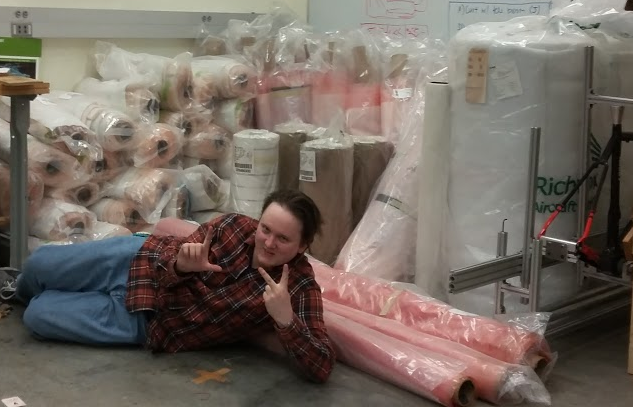
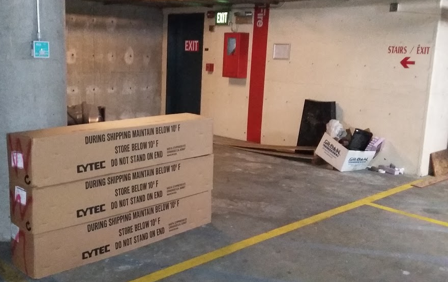

So, remember how after the donations from PCC I said our main priority was getting a freezer? Now our main priority is getting like 3 freezers.

We filled the whole van with materials from Boeing. Kevin was extremely helpful, helping us load, ship, and unload the donations. Our contact, Loren, asked that we send pictures of the things we make with those donations, and was interested in hearing about our process. He said that when other universities get big donations like this, they often end up trading materials to get what they need. It might be a good option to try and trade all the excess fiberglass we've accumulated for another freezer. He estimated that we picked up 60k worth of donations. 

We got:
two 60' rolls of 1515-3M Meltbond adhesive (!!!)
four 50' rolls of 7781 prepreg fiberglass
nine 176' rolls of VMS 9-17 prepreg carbon fiber
nine 65 yard rolls of Cycom 6070 7781 prepreg fiberglass
one 60" x 356' roll of prepreg carbon fiber (unidirectional?)
twenty-six small vacuum bagging kits
twenty-eight large vacuum bagging kits
two 45" x 50 yard bales of RC3000-10 breather material
one unmarked roll of thin breather-like material
five 24" x 300 yard rolls of 60001 peel ply
one 0.0035" x 30" x 650' roll of Stretch-VAC 3000 vacuum bagging film
one roll of Stretch-VAC 2000, unknown dmiensions
three rolls of Stretch-VAC 3000, unknown dimensions (rain water trapped in the bag)
You'll notice that all the above pictures look pretty crowded. The biology department was very gracious, allowing us to take up a good chunk of floor space in both cold rooms. We were able to get everything in there except for three rolls of 7781 fiberglass. There was no way to get them in either of the cold rooms without blocking needed floor space. Those three rolls are now sitting in the parking garage (P1) of the FAB (see below). Loren said they should be okay to sit at room temperature for a couple of weeks. The vacuum bagging supplies are all being stored in the ME capstone lab (see above)... We really need a permanent solution for all this. We basically have a composites lab squatting in multiple other lab spaces at this point. 

This is all fantastic news for the LV3 and LV4 teams. Thanks to everyone involved. 
