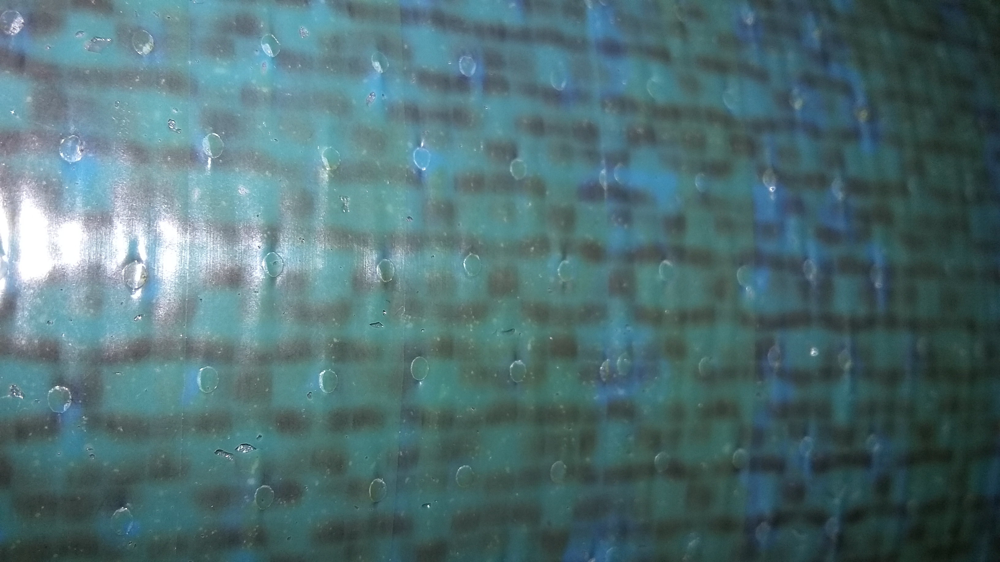

#LV3 update for 2016-4-14

We're putting the finishing touches on the fin frames and the parts and tooling for the nose. We will most likely have that ready for Machine Sciences on Friday. 
The [rail sled has also been designed](https://github.com/psas/sw-cad-airframe-lv3.0/tree/master/solidWorks/railSled) and is ready to be manufactured. It will be be made out of three 1/4" layers of laser-cut HDPE with an aluminum base.

Also, [all of the updates are now on the LV3 repo](https://github.com/psas/sw-cad-airframe-lv3.0/tree/master/doc/updates). A previous version of the layup procedure was put up earlier, and there should be a document for our latest procedure up there later today.
A document describing the overall design process is coming soon. (All the information already exists, it's just scattered.)

##Layups
Since the last update, we conducted some tests based on LV4's results with using the 1515 adhesive as a surface finish.
We also did a full size layup based on the results from those tests.

The LV4 team will fill people in on the details, but they noticed in the datasheet for the 1515 adhesive that it's also useable as a patching material and a cosmetic finish. So, we can lay that up on the outside of a module and sand it down to get a really nice aerodynamic surface. It also fills in any dry cells.
They tried a test with a vacuum bag and another one with a vacuum bag and caul plate. Both turned out with no delaminations, and none could be induced from hand-sqeezing.
The only real downside is that it makes the rocket green/blue instead of black. 

###LU16.6 through LU16.9
The tests consisted of:
* LU16.6 -- flat coupons using PCC's CF:
	* CF; release film; mold release; aluminum plate (for reference. same as LU16.3 and LU16.4)
	* CF; layer of shrink tape; release film; mold release; aluminum plate
	* CF; mold release; aluminum plate flat coupons using
* LU16.7 -- Boeing's CF:
	* CF; release film; mold release; aluminum plate
	* CF; layer of shrink tape; release film; mold release; aluminum plate
	* CF; mold release; aluminum plate
* LU16.8 -- mini cylinder with an adhesive coating on half and shrink tape on the whole thing (Boeing's CF)
* LU16.9 -- small rings of CF layed up on a spare bar of aluminum, just for fun.

The results were as follows:
* The shrink-taped mini tube was just as hard and smooth as the stuff from the last team. None of the people I had handle it could feel any delaminations. The adhesive-skinned portion is even better, and, as we saw from LV4's layup, may be sanded for an even better finish.
* The flat coupons are a little quirky. 
	*The tape surfacing didn't turn out well. The shrink tape shrunk... go figure. So, it got all wrinkly and transferred that to the CF. 
	* The release film surfacing was pretty much the same as the previous layups. 
	* The raw caul plate surfacing was very smooth where there was sufficient pressure. The adhesive leaked through the bottom layer of the flat PCC CF, which we'll need to consider for the fins.
	* The Boeing CF is a similar weave as the PCC, but has an even worse wetting problem. The adhesive doesn't leak through it though.

After that test, we added another layer of adhesive to the mini cylinder and put it through another cure cycle (hot enough for adhesive but cold enough for cured epoxy). 
The motivation behind this was because trying to sand down a single layer would most likely damage the fibers. On a full sized layup, this would be pretty much guaranteed. 
So, we now have samples of (everything shrink-taped):
* CF outer surface
* single layer adhesive surface
* double layer adhesive surface (due to overlap)
* CF surface with single layer post-cure adhesive surface
* single layer adhesive surface with single layer post-cure adhesive surface
* double layer adhesive surface with single layer post-cure adhesive surface
* CF surface with double layer post-cure adhesive surface (due to overlap)
* single layer adhesive surface with double layer post-cure adhesive surface

Long story short: we were too quick to abandon the tape method as too skill based / not repeatable enough. The shrink tape reduced a lot of the dry cell problem, but the adhesive completely eliminated it. 
We also found that we can make the tape much easier to remove by using the outside surface of the tape, rather than the inside surface (as it sits on the spool).
The small scale test was actually able to withstand Andrew's full body weight, when he stood on it laterally!

###LU16.10
We did an 18" layup with a single layer of adhesive surfacing and shrink tape around the outside. The surface finish turned out extremely well.
Interestingly, the pattern of the nomex is shown by preferential flow of the adhesive. 
It's still on the mandrel now. We're going to take it off once it's cool. 
If we don't detect any thumb-strengh delaminations, we're going to do another tomorrow. 
We'll likely add another layer of release film to the inside of our future layups, since the shrink tape results in the mandrel curing much tighter of the mandrel.

Of course, now that the modules have this color, there is only one [logical course of action](pdxTile.jpg).
