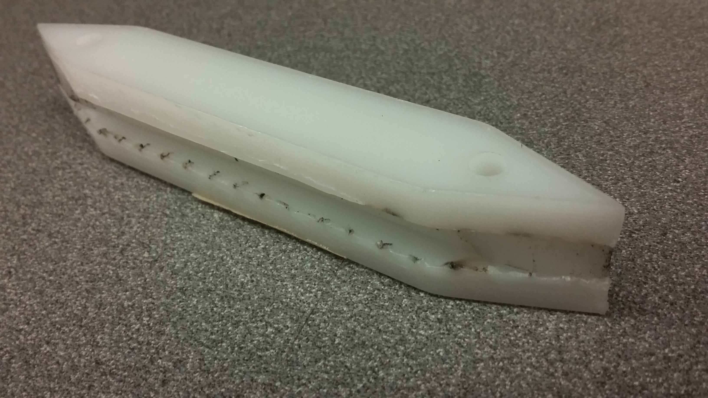

#LV3 Update 2016-5-8
##Nose Cone
As you may have heard, we're not going to get as much stuff from Machine Sciences as we hoped, at least not in time for the capstone to finish and cutting it pretty close to even have a nose for launch. 

In order to still get a nose cone, we're going to move to a more traditional molding design. We will be casting a plaster block, machining a positive plug in the shape of the outer nose surface, forming a fiberglass mold from the plug, laying up CF in the FG mold, and then joining two CF shells together to form the nose. 

This will require some modification of the tip and ring designs, but the new designs will also be much simpler. Mike was a little hesitant about letting us machine plaster (could be messy). We'll try to be as clean as possible, in case people need to copy us in the future. With the right composition and machine settings, it can be pretty clean. 

Pouring the plaster block and making the CAD/CAM will begin on Monday.

##Modules
###LU16.10
We did a layup (mentioned in the previous update) using adhesive surfacing on the outside, and shrink tape around that. The perforation in the shrink tape created small nodules. 

The shrink tape pushed even more epoxy through the perforated release film, sticking the module to the mandrel. To remove it, we used the wood rings from 2014 to push on the dummy rings, and a new disc to push the mandrel through. 

Additionally, the shrink tape squeezed some adhesive over the lip of the male ring, gluing it to the dummy ring. These are still stuck together. We will try an acetone bath to remove them some time soon. 

This was later subjected to an [https://www.youtube.com/watch?v=tIBGjN-DmQA](axial compression test.) It began pinging between 7 000 lbf and 7 500 lbf, with brittle failure around 10 000 lbf, similar to the 2014 tests. 

The module appears to have failed at the edge of the inside flange of the male ring. The CF subducted itself on both the inner and outer layers. Where the failure occurred, the nomex tore away from itself, leaving traces in the adhesive. 

After the destructive test, the ends of the module were cut off with a zip cut tool, and some square coupons were cut from the module. The coupons showed that the 1515 adhesive was wetting the honeycomb core. 

The NGCF (LV4) team also did a 3-point "[bend test](https://www.youtube.com/watch?v=YhxZ_cO8BpQ)" of their NGCF16.2 layup. It turned out to really be more of a large scale hardness test, since the loading points just penetrated into the module. This gives us a bit of an idea of how a module might fail when impacting a rock. 

In this much more likely mode of failure, the modules are weaker by a factor of around 30 to 70. It only takes 1 or 2 hundred lbf to yield a module this way, which was within the noise of the load cell. 

Since the modules have such low compliance, the loading points could contact a very small area and yield small portions at a time. The far loading points showed no visible damage after the test, while the middle point tore the outer surface. We'll need to figure out some sort of ultrasonic testing procedure, to check the modules after landing. 

###LU16.11
This was a 4 inch test, using the Boeing CF, and plain vacuum bagging. It turned out similar to the other plain vacuum bagged tests, with some veins protruding out of the module.

This layup also featured a test of the low temperature shrink tape left over from the CF bike capstone... It doesn't work at 350 F...

###LU16.12
This was a copy of LU16.10, but with the non-perforated release film from the vac-bag kits from Boeing. If the nodules are carefully sanded down, it should be flight-worthy.

###LU16.13
In the interest of still producing something more standard, we made a module without the adhesive surfacing. This was wrapped with shrink tape, covered with non-perforated release film, and then vacuum bagged.

This completely eliminated the nodules on the surface and gave an excellent surface finish, so we'll definitely be using this surfacing technique from here on out. However, the module still wound up with many dry cells. 

This module might still be usable if it's recooked with adhesive, but we won't be flying a black rocket. :(

I'm not sure why I don't have pictures of either LU16.12 or LU16.13. 

##Fins
It sounds like Machine Sciences will have the fins programmed on Monday. We will have a better idea of how soon they will be here after that. These are probably going to be the only new parts we get from them, since they have a lot of customers that got in before us. 

##Miscellaneous
We have a laser-cut prototype of the rail sled. We probably won't be laser-cutting the final version, because laser-cutting HDPE really sucks (technical term). 

