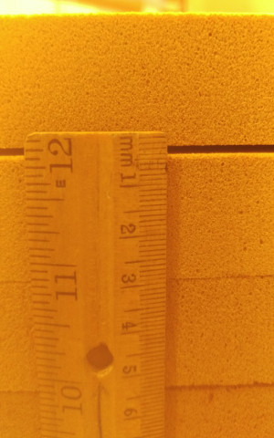
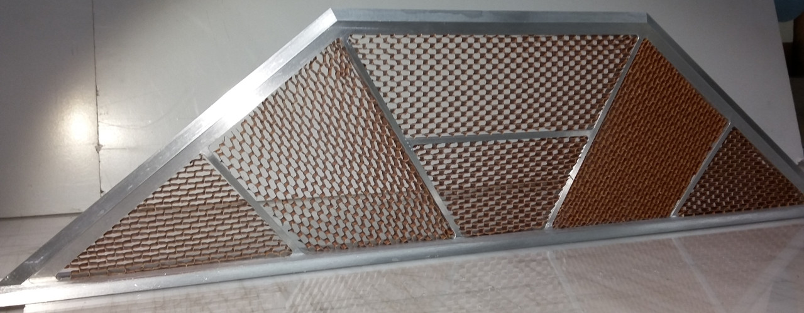
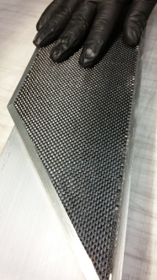
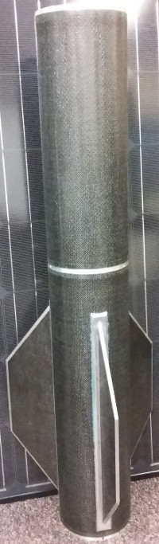

# LV3 Update 2016-6-17
A few things have gone on since the last update...

The LV3 team has now graduated, so there will probably be some change in the ammount of person-hours put towards the airframe. (not sure if it's more or less at this point)

## Nose Cone
The plan to make the nose cone out of plaster didn't work out. It couldn't be machined in the mill, since it would ruin the lubrication. Mike decided it would be too dangerous to turn on the lathe (very right). It's unclear whether it would be possible to clamp, and there's a high chance it would shatter and fly appart when machining near the tip of the ose. 

The new plan is to use machinable foam. We ordered 4 sheets of 1" thick 18 lb/ft^3 high temperature machinable foam. 
To make a block thick enough to make a half-mold, we epoxied the 4 sheets together. Unfortunately, during the cure cycle, the sheets warped and delaminated. 
Esco has offered to do the machining for us. Since they regularly create tooling from similar materials, they may be able to help us re-adhere the foam sheets.

The CAD for the nose mold is finished. The CAD for the tip needs to be updated. The CAM and machining of the tip would be a good small project, if someone wants to get time in the machine shop.

## Fins
We got the fins from Machine Sciences. They look really cool. Unfortunately, they ended up 2" shorter than they were supposed to be! (happened in CAD) So, any flight configuration that uses them will need some lead in the nose cone. This means that L13a will likely go 6.3 km instead of 8 km. Maybe they will be of use in a dynamically unstable configuration when the RCS is ready for that.

We did layups to complete the individual fins and then to attach them to a 24" module. That module still needs a tip-to-tip layup done, but it looks like something rockety now. 

## Layups
We are doing a layup on Saturday, June 18 at 8 am in room EB 480. Anyone interested in watching or participating in a layup is welcome.
This layup will be an attempt at making a radio-transparent module. We will substitute the CF layers with fiberglass. 

## Documentation
The [module layup procedure](../mfg/moduleProcedure.md) and the [fin layup procedures](../mfg/finProcedure.md) have now been updated/written. 
If you have time, or are planning on coming to a layup, please read through them. If you find any spots that are wrong/unclear, please start an issue on it, or email me, or something. 
The procedures still need pictures in a lot of spots. Hopefully that can go in soon.

The [CAM files](../../cad/railSled/CAM) for the rail sled are now up. The CAM for the fin jigs will be up soon too. 

## Miscellaneous
The EB 480 lab is apparently going to undergo some reorganization this summer. So, we've been asked to remove the layup table and pile of nomex. (The oven and freezer can stay, since they can't really go anywhere else.)
